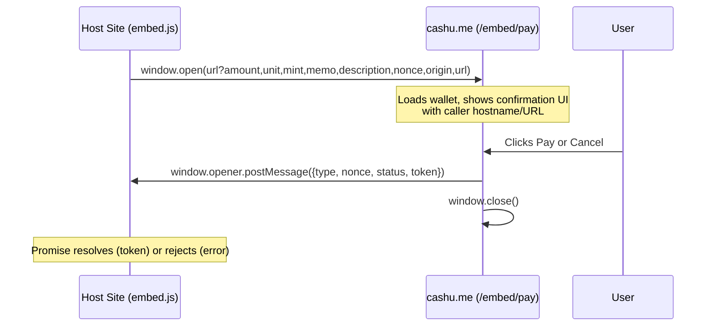

# Cashu.me Embed SDK

Embeddable payment SDK that lets any website request Cashu payments from cashu.me wallet users.

## How it works

1. Host site loads `embed.js` from cashu.me
2. Host calls `cashu.requestPayment(...)` — opens a popup to cashu.me
3. User sees the payment details (amount, caller URL, description) and confirms
4. Wallet creates a Cashu token and sends it back via `postMessage`
5. Host receives the token and the promise resolves

The popup approach is used instead of an iframe to prevent clickjacking — the user can verify the cashu.me URL in the address bar before confirming.

## Quick Start

```html
<script src="https://cashu.me/embed.js"></script>
<script>
  const cashu = new CashuPay();

  async function pay() {
    try {
      const result = await cashu.requestPayment({
        amount: 100,
        unit: "sat",
        description: "Premium article access",
      });
      console.log("Received token:", result.token);
    } catch (e) {
      console.error("Payment failed:", e.message);
    }
  }
</script>
```

## API

### `new CashuPay(options?)`

Creates a new SDK instance.

| Option    | Type     | Default              | Description                           |
| --------- | -------- | -------------------- | ------------------------------------- |
| `origin`  | `string` | `"https://cashu.me"` | Base URL of the cashu.me instance     |
| `timeout` | `number` | `120000`             | Payment timeout in ms (default 2 min) |

### `cashu.requestPayment(params) → Promise<{ token }>`

Opens a popup requesting payment from the user. Returns a promise.

**Parameters:**

| Param         | Type     | Required | Description                                                     |
| ------------- | -------- | -------- | --------------------------------------------------------------- |
| `amount`      | `number` | yes      | Amount in the unit's base denomination                          |
| `unit`        | `string` | no       | Currency unit: `"sat"`, `"usd"`, `"eur"`, etc. Default: `"sat"` |
| `description` | `string` | no       | Text shown to the user explaining what the payment is for       |
| `memo`        | `string` | no       | Short note attached to the payment                              |
| `mint`        | `string` | no       | Mint URL. If omitted, the user's active mint is used            |

**Resolve value:**

```js
{
  token: "cashuB...";
} // Encoded Cashu token containing the proofs
```

**Rejection errors:**

| Error message            | Cause                                           |
| ------------------------ | ----------------------------------------------- |
| `"Invalid amount"`       | `amount` is missing, zero, or negative          |
| `"Popup blocked"`        | Browser blocked the popup window                |
| `"Payment cancelled"`    | User closed the popup or clicked Cancel         |
| `"Payment timed out"`    | No response within the timeout period           |
| `"Insufficient balance"` | User doesn't have enough funds (shown in popup) |
| Other                    | Wallet error during token creation              |

## Protocol



### Request: URL query parameters

Parameters are passed via URL (not postMessage) to avoid the race condition of the popup needing to finish loading before it can receive messages.

| Param         | Type   | Required | Description                           |
| ------------- | ------ | -------- | ------------------------------------- |
| `amount`      | number | yes      | Amount to pay                         |
| `unit`        | string | no       | Currency unit (default: `sat`)        |
| `mint`        | string | no       | Mint URL                              |
| `memo`        | string | no       | Payment memo                          |
| `description` | string | no       | Description shown to user             |
| `nonce`       | string | yes      | UUID correlating request and response |
| `origin`      | string | yes      | Caller's `window.location.origin`     |
| `url`         | string | yes      | Caller's `window.location.href`       |

### Response: postMessage

The popup sends one message via `window.opener.postMessage(payload, '*')` before closing.

**Success:**

```json
{
  "type": "cashu:payment-result",
  "nonce": "550e8400-e29b-41d4-a716-446655440000",
  "status": "success",
  "token": "cashuB..."
}
```

**Error:**

```json
{
  "type": "cashu:payment-result",
  "nonce": "550e8400-e29b-41d4-a716-446655440000",
  "status": "error",
  "error": "User cancelled"
}
```

### Security

- **embed.js validates `event.origin`** — only accepts messages from the configured cashu.me origin
- **embed.js validates `event.data.nonce`** — only accepts messages matching the nonce it generated, preventing cross-tab interference
- **embed.js validates `event.data.type`** — only acts on `cashu:payment-result` messages
- **Popup shows caller hostname and full URL** — user can verify who is requesting payment before confirming
- **No inbound message listener on the popup** — the popup reads URL params only, no `postMessage` listener, eliminating that attack surface

## Files

| File                          | Description                                |
| ----------------------------- | ------------------------------------------ |
| `public/embed.js`             | Standalone SDK loaded by third-party sites |
| `src/pages/EmbedPayPage.vue`  | Popup payment confirmation page            |
| `src/router/routes.js`        | Route entry for `/embed/pay`               |
| `embedded-example/index.html` | Example client for testing                 |

## Development

Run the wallet:

```bash
docker compose up -d --build
# or
quasar dev
```

Serve the example client from a different origin:

```bash
cd embedded-example
python3 -m http.server 8888
```

Open `http://localhost:8888` and click "Pay with Cashu".
